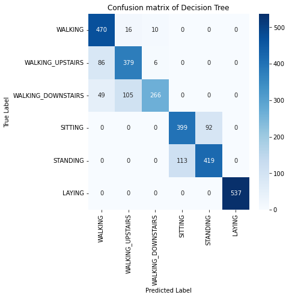
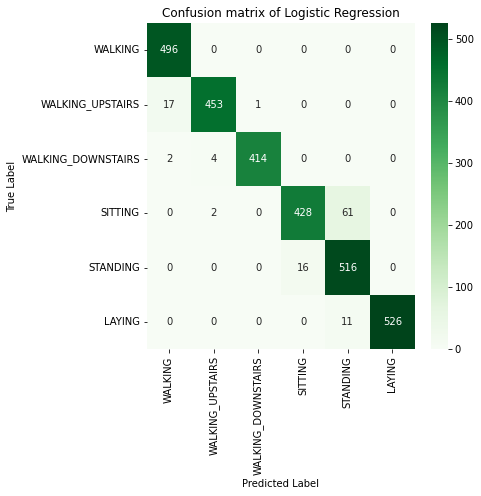
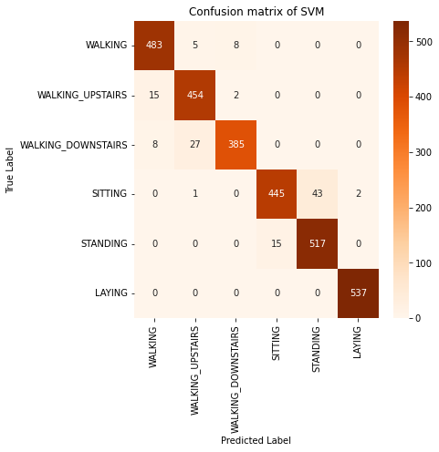
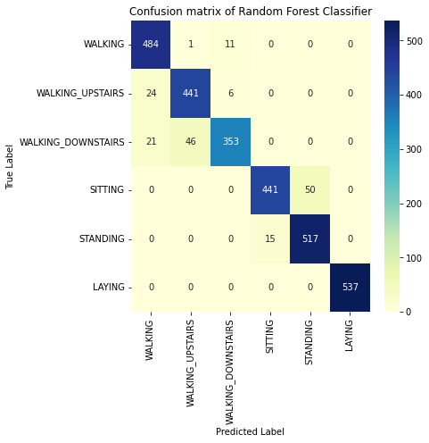
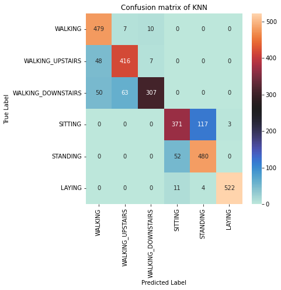
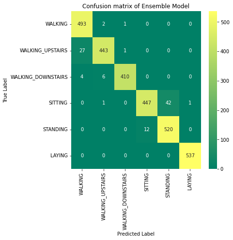

```python
# load dataset
import numpy as np
from numpy import dstack
from numpy import array
from numpy import vstack
from pandas import read_csv
from pandas import DataFrame
from numpy import unique
from matplotlib import pyplot as plt
import seaborn as sns
from sklearn import preprocessing
from sklearn.metrics import plot_confusion_matrix
# load a single file as a numpy array
def load_file(filepath):
	dataframe = read_csv(filepath, header=None, delim_whitespace=True)
	return dataframe.values
```


```python
X_train = load_file('D:/desktop/HAR/UCI HAR Dataset/train/X_train.txt')
y_train = load_file('D:/desktop/HAR/UCI HAR Dataset/train/y_train.txt')
X_test = load_file('D:/desktop/HAR/UCI HAR Dataset/test/X_test.txt')
y_test = load_file('D:/desktop/HAR/UCI HAR Dataset/test/y_test.txt')
```


```python
from sklearn.preprocessing import StandardScaler
scaler= StandardScaler()
scaler.fit(X_train, X_test)
Xtrain=scaler.transform(X_train)
Xtest=scaler.transform(X_test)
print(X_train)
print(Xtrain)
```

    [[ 0.28858451 -0.02029417 -0.13290514 ... -0.84124676  0.17994061
      -0.05862692]
     [ 0.27841883 -0.01641057 -0.12352019 ... -0.8447876   0.18028889
      -0.05431672]
     [ 0.27965306 -0.01946716 -0.11346169 ... -0.84893347  0.18063731
      -0.04911782]
     ...
     [ 0.27338737 -0.01701062 -0.04502183 ... -0.77913261  0.24914484
       0.04081119]
     [ 0.28965416 -0.01884304 -0.15828059 ... -0.78518142  0.24643223
       0.02533948]
     [ 0.35150347 -0.01242312 -0.20386717 ... -0.78326693  0.24680852
       0.03669484]]
    [[ 0.20064157 -0.0636826  -0.41962845 ... -0.68721921  0.40794614
      -0.00756789]
     [ 0.05594788  0.03148567 -0.25390836 ... -0.694138    0.40911698
       0.00787517]
     [ 0.07351535 -0.04341648 -0.07629468 ... -0.702239    0.4102883
       0.02650234]
     ...
     [-0.01566765  0.0167814   1.13222107 ... -0.56584847  0.64059683
       0.34870928]
     [ 0.21586648 -0.02812252 -0.86770988 ... -0.57766781  0.63147758
       0.29327564]
     [ 1.09620157  0.12919873 -1.67268082 ... -0.57392691  0.63274259
       0.33396081]]
    


```python
import pandas as pd
from sklearn.metrics import accuracy_score
from sklearn.metrics import classification_report, confusion_matrix
from sklearn.linear_model import LogisticRegression
from sklearn.tree import DecisionTreeClassifier
from sklearn.svm import SVC
from sklearn.ensemble import RandomForestClassifier
from sklearn.neighbors import KNeighborsClassifier
target_names = ['WALKING', 'WALKING_UPSTAIRS', 'WALKING_DOWNSTAIRS', 'SITTING', 'STANDING', 'LAYING']
from sklearn.model_selection import RepeatedStratifiedKFold
from sklearn.model_selection import GridSearchCV
from sklearn.decomposition import PCA
```


```python
model = LogisticRegression()
solvers = ['newton-cg', 'lbfgs', 'liblinear']
penalty = ['l2']
c_values = [100, 10, 1.0, 0.1, 0.01]
# define grid search
grid = dict(solver=solvers,penalty=penalty,C=c_values)
cv = RepeatedStratifiedKFold(n_splits=10, n_repeats=3, random_state=1)
grid_search = GridSearchCV(estimator=model, param_grid=grid, n_jobs=-1, cv=cv, scoring='accuracy',error_score=0)
grid_result = grid_search.fit(Xtrain, y_train)
# summarize results
print("Best: %f using %s" % (grid_result.best_score_, grid_result.best_params_))
means = grid_result.cv_results_['mean_test_score']
stds = grid_result.cv_results_['std_test_score']
params = grid_result.cv_results_['params']
for mean, stdev, param in zip(means, stds, params):
    print("%f (%f) with: %r" % (mean, stdev, param))
```

    C:\Users\HP\anaconda3\lib\site-packages\sklearn\utils\validation.py:63: DataConversionWarning: A column-vector y was passed when a 1d array was expected. Please change the shape of y to (n_samples, ), for example using ravel().
      return f(*args, **kwargs)
    

    Best: 0.986398 using {'C': 1.0, 'penalty': 'l2', 'solver': 'liblinear'}
    0.981955 (0.003140) with: {'C': 100, 'penalty': 'l2', 'solver': 'newton-cg'}
    0.979552 (0.005273) with: {'C': 100, 'penalty': 'l2', 'solver': 'lbfgs'}
    0.982771 (0.002861) with: {'C': 100, 'penalty': 'l2', 'solver': 'liblinear'}
    0.983633 (0.002969) with: {'C': 10, 'penalty': 'l2', 'solver': 'newton-cg'}
    0.981819 (0.003839) with: {'C': 10, 'penalty': 'l2', 'solver': 'lbfgs'}
    0.985174 (0.002726) with: {'C': 10, 'penalty': 'l2', 'solver': 'liblinear'}
    0.985628 (0.002780) with: {'C': 1.0, 'penalty': 'l2', 'solver': 'newton-cg'}
    0.985673 (0.002997) with: {'C': 1.0, 'penalty': 'l2', 'solver': 'lbfgs'}
    0.986398 (0.002459) with: {'C': 1.0, 'penalty': 'l2', 'solver': 'liblinear'}
    0.983904 (0.002985) with: {'C': 0.1, 'penalty': 'l2', 'solver': 'newton-cg'}
    0.983995 (0.003254) with: {'C': 0.1, 'penalty': 'l2', 'solver': 'lbfgs'}
    0.982046 (0.003189) with: {'C': 0.1, 'penalty': 'l2', 'solver': 'liblinear'}
    0.976015 (0.004654) with: {'C': 0.01, 'penalty': 'l2', 'solver': 'newton-cg'}
    0.976151 (0.004578) with: {'C': 0.01, 'penalty': 'l2', 'solver': 'lbfgs'}
    0.969532 (0.005440) with: {'C': 0.01, 'penalty': 'l2', 'solver': 'liblinear'}
    


```python
modelLR = LogisticRegression(solver='liblinear', penalty='l2', C=1.0)
modelLR.fit(Xtrain, y_train)
y_pred_LR = modelLR.fit(Xtrain, y_train).predict(Xtest)
```

    C:\Users\HP\anaconda3\lib\site-packages\sklearn\utils\validation.py:63: DataConversionWarning: A column-vector y was passed when a 1d array was expected. Please change the shape of y to (n_samples, ), for example using ravel().
      return f(*args, **kwargs)
    C:\Users\HP\anaconda3\lib\site-packages\sklearn\utils\validation.py:63: DataConversionWarning: A column-vector y was passed when a 1d array was expected. Please change the shape of y to (n_samples, ), for example using ravel().
      return f(*args, **kwargs)
    


```python
model = DecisionTreeClassifier()
max_depth = [1,2,3,4,5]
min_samples_split = [1,2,3,4,5]
# define grid search
grid = dict(max_depth=max_depth,min_samples_split=min_samples_split)
cv = RepeatedStratifiedKFold(n_splits=10, n_repeats=3, random_state=1)
grid_search = GridSearchCV(estimator=model, param_grid=grid, n_jobs=-1, cv=cv, scoring='accuracy',error_score=0)
grid_result = grid_search.fit(Xtrain, y_train)
# summarize results
print("Best: %f using %s" % (grid_result.best_score_, grid_result.best_params_))
means = grid_result.cv_results_['mean_test_score']
stds = grid_result.cv_results_['std_test_score']
params = grid_result.cv_results_['params']
for mean, stdev, param in zip(means, stds, params):
    print("%f (%f) with: %r" % (mean, stdev, param))
```

    Best: 0.904835 using {'max_depth': 5, 'min_samples_split': 4}
    0.000000 (0.000000) with: {'max_depth': 1, 'min_samples_split': 1}
    0.378173 (0.001248) with: {'max_depth': 1, 'min_samples_split': 2}
    0.378264 (0.001033) with: {'max_depth': 1, 'min_samples_split': 3}
    0.378219 (0.001119) with: {'max_depth': 1, 'min_samples_split': 4}
    0.378128 (0.001318) with: {'max_depth': 1, 'min_samples_split': 5}
    0.000000 (0.000000) with: {'max_depth': 2, 'min_samples_split': 1}
    0.544885 (0.001151) with: {'max_depth': 2, 'min_samples_split': 2}
    0.544840 (0.001178) with: {'max_depth': 2, 'min_samples_split': 3}
    0.544840 (0.001125) with: {'max_depth': 2, 'min_samples_split': 4}
    0.544659 (0.001397) with: {'max_depth': 2, 'min_samples_split': 5}
    0.000000 (0.000000) with: {'max_depth': 3, 'min_samples_split': 1}
    0.786862 (0.008211) with: {'max_depth': 3, 'min_samples_split': 2}
    0.786772 (0.008064) with: {'max_depth': 3, 'min_samples_split': 3}
    0.786726 (0.008161) with: {'max_depth': 3, 'min_samples_split': 4}
    0.786817 (0.008245) with: {'max_depth': 3, 'min_samples_split': 5}
    0.000000 (0.000000) with: {'max_depth': 4, 'min_samples_split': 1}
    0.889102 (0.010667) with: {'max_depth': 4, 'min_samples_split': 2}
    0.889329 (0.010664) with: {'max_depth': 4, 'min_samples_split': 3}
    0.889011 (0.010608) with: {'max_depth': 4, 'min_samples_split': 4}
    0.889238 (0.010613) with: {'max_depth': 4, 'min_samples_split': 5}
    0.000000 (0.000000) with: {'max_depth': 5, 'min_samples_split': 1}
    0.904789 (0.010628) with: {'max_depth': 5, 'min_samples_split': 2}
    0.904744 (0.010483) with: {'max_depth': 5, 'min_samples_split': 3}
    0.904835 (0.010676) with: {'max_depth': 5, 'min_samples_split': 4}
    0.904699 (0.010758) with: {'max_depth': 5, 'min_samples_split': 5}
    


```python
from sklearn.model_selection import RandomizedSearchCV
#parameters = {'max_depth':np.arange(2,10,2)}
dt_classifier = DecisionTreeClassifier(max_depth=5, min_samples_split= 4)
#dt_classifier_rs = RandomizedSearchCV(dt_classifier,random_state = 42)
dt_classifier.fit(Xtrain, y_train)
y_pred_dt = dt_classifier.predict(Xtest)
```


```python
dt_accuracy = accuracy_score(y_true = y_test, y_pred = y_pred_dt)
print("Accuracy using Decision tree:", dt_accuracy)
```

    Accuracy using Decision tree: 0.838140481845945
    


```python
print("Classification Report for Decision Tree: ")
print()
print(classification_report(y_test,y_pred_dt, target_names=target_names))
```

    Classification Report for Decision Tree: 
    
                        precision    recall  f1-score   support
    
               WALKING       0.78      0.95      0.85       496
      WALKING_UPSTAIRS       0.76      0.80      0.78       471
    WALKING_DOWNSTAIRS       0.94      0.63      0.76       420
               SITTING       0.78      0.81      0.80       491
              STANDING       0.82      0.79      0.80       532
                LAYING       1.00      1.00      1.00       537
    
              accuracy                           0.84      2947
             macro avg       0.85      0.83      0.83      2947
          weighted avg       0.85      0.84      0.84      2947
    
    


```python
cm_dt= confusion_matrix(y_test, y_pred_dt)
plt.figure(figsize=(6,6))
ax=sns.heatmap(cm_dt, xticklabels=target_names, yticklabels=target_names, annot=True, fmt='g', cmap='Blues')
plt.title("Confusion matrix of Decision Tree")
plt.ylabel('True Label')
plt.xlabel('Predicted Label')
plt.show()
```


    

    


```python
accuracy_logistic = accuracy_score(y_true = y_test, y_pred = y_pred_LR)
print("Accuracy using Logistic Regression : ", accuracy_logistic)
```

    Accuracy using Logistic Regression :  0.9613165931455717
    


```python
print("Classification Report for Logistic regression : ")
print()
print(classification_report(y_test, y_pred_LR, target_names=target_names))
```

    Classification Report for Logistic regression : 
    
                        precision    recall  f1-score   support
    
               WALKING       0.96      1.00      0.98       496
      WALKING_UPSTAIRS       0.99      0.96      0.97       471
    WALKING_DOWNSTAIRS       1.00      0.99      0.99       420
               SITTING       0.96      0.87      0.92       491
              STANDING       0.88      0.97      0.92       532
                LAYING       1.00      0.98      0.99       537
    
              accuracy                           0.96      2947
             macro avg       0.96      0.96      0.96      2947
          weighted avg       0.96      0.96      0.96      2947
    
    


```python
cm_lr= confusion_matrix(y_test,y_pred_LR)
plt.figure(figsize=(6,6))
ax=sns.heatmap(cm_lr, xticklabels=target_names, yticklabels=target_names, annot=True, fmt='g', cmap='Greens')
plt.title("Confusion matrix of Logistic Regression")
plt.ylabel('True Label')
plt.xlabel('Predicted Label')
plt.show()
```


    

    


```python
model = SVC()
kernel = ['linear', 'poly', 'rbf', 'sigmoid']
c = [0.1, 1, 10, 100, 0.001]
# define grid search
grid = dict(C=c,kernel=kernel)
cv = RepeatedStratifiedKFold(n_splits=10, n_repeats=3, random_state=1)
grid_search = GridSearchCV(estimator=model, param_grid=grid, n_jobs=-1, cv=cv, scoring='accuracy',error_score=0)
grid_result=grid_search.fit(Xtrain, y_train)
# summarize results
print("Best: %f using %s" % (grid_result.best_score_, grid_result.best_params_))
#means = grid_result.cv_results_['mean_test_score']
#stds = grid_result.cv_results_['std_test_score']
#params = grid_result.cv_results_['params']
#for mean, stdev, param in zip(means, stds, params):
    #print("%f (%f) with: %r" % (mean, stdev, param))
```

    C:\Users\HP\anaconda3\lib\site-packages\sklearn\utils\validation.py:63: DataConversionWarning: A column-vector y was passed when a 1d array was expected. Please change the shape of y to (n_samples, ), for example using ravel().
      return f(*args, **kwargs)
    

    Best: 0.988030 using {'C': 100, 'kernel': 'rbf'}
    


```python
svc_model=SVC(C= 100, kernel='rbf')
svc_model.fit(Xtrain, y_train)
```

    C:\Users\HP\anaconda3\lib\site-packages\sklearn\utils\validation.py:63: DataConversionWarning: A column-vector y was passed when a 1d array was expected. Please change the shape of y to (n_samples, ), for example using ravel().
      return f(*args, **kwargs)
    


    SVC(C=100)


```python
y_pred_svc=svc_model.predict(Xtest)
```


```python
accuracy_svc=accuracy_score(y_true= y_test, y_pred= y_pred_svc)
print("Accuracy using SVM : ", accuracy_svc)
```

    Accuracy using SVM :  0.9572446555819477
    


```python
print("Classification Report for SVM : ")
print()
print(classification_report(y_test, y_pred_svc, target_names=target_names))
```

    Classification Report for SVM : 
    
                        precision    recall  f1-score   support
    
               WALKING       0.95      0.97      0.96       496
      WALKING_UPSTAIRS       0.93      0.96      0.95       471
    WALKING_DOWNSTAIRS       0.97      0.92      0.94       420
               SITTING       0.97      0.91      0.94       491
              STANDING       0.92      0.97      0.95       532
                LAYING       1.00      1.00      1.00       537
    
              accuracy                           0.96      2947
             macro avg       0.96      0.96      0.96      2947
          weighted avg       0.96      0.96      0.96      2947
    
    


```python
cm_svc= confusion_matrix(y_test,y_pred_svc)
plt.figure(figsize=(6,6))
ax=sns.heatmap(cm_svc, xticklabels=target_names, yticklabels=target_names, annot=True, fmt='g', cmap='Oranges')
plt.title("Confusion matrix of SVM")
plt.ylabel('True Label')
plt.xlabel('Predicted Label')
plt.show()
```


    

    


```python

model = RandomForestClassifier()
max_features = ['sqrt', 'log2', 'auto']
n_estimators =[10,100,1000]
# define grid search
grid = dict(max_features=max_features,n_estimators=n_estimators)
cv = RepeatedStratifiedKFold(n_splits=10, n_repeats=3, random_state=1)
grid_search = GridSearchCV(estimator=model, param_grid=grid, n_jobs=-1, cv=cv, scoring='accuracy',error_score=0)
grid_result = grid_search.fit(Xtrain, y_train)
# summarize results
print("Best: %f using %s" % (grid_result.best_score_, grid_result.best_params_))
#means = grid_result.cv_results_['mean_test_score']
#stds = grid_result.cv_results_['std_test_score']
#params = grid_result.cv_results_['params']
#for mean, stdev, param in zip(means, stds, params):
    #print("%f (%f) with: %r" % (mean, stdev, param))
```

    C:\Users\HP\anaconda3\lib\site-packages\sklearn\model_selection\_search.py:880: DataConversionWarning: A column-vector y was passed when a 1d array was expected. Please change the shape of y to (n_samples,), for example using ravel().
      self.best_estimator_.fit(X, y, **fit_params)
    

    Best: 0.982862 using {'max_features': 'log2', 'n_estimators': 1000}
    


```python
clf= RandomForestClassifier(max_features='log2',n_estimators= 1000)
clf.fit(Xtrain, y_train)
```

    C:\Users\HP\AppData\Local\Temp/ipykernel_14348/2224439910.py:2: DataConversionWarning: A column-vector y was passed when a 1d array was expected. Please change the shape of y to (n_samples,), for example using ravel().
      clf.fit(Xtrain, y_train)
    


    RandomForestClassifier(max_features='log2', n_estimators=1000)


```python
y_pred_clf=clf.predict(Xtest)
clf_accuracy=accuracy_score(y_true= y_test, y_pred= y_pred_clf)
print("Accuracy using Random Forest Classifier : ", clf_accuracy)
```

    Accuracy using Random Forest Classifier :  0.9409569053274517
    


```python
print("Classification Report for CLF : ")
print()
print(classification_report(y_test, y_pred_clf, target_names=target_names))
```

    Classification Report for CLF : 
    
                        precision    recall  f1-score   support
    
               WALKING       0.91      0.98      0.94       496
      WALKING_UPSTAIRS       0.90      0.94      0.92       471
    WALKING_DOWNSTAIRS       0.95      0.84      0.89       420
               SITTING       0.97      0.90      0.93       491
              STANDING       0.91      0.97      0.94       532
                LAYING       1.00      1.00      1.00       537
    
              accuracy                           0.94      2947
             macro avg       0.94      0.94      0.94      2947
          weighted avg       0.94      0.94      0.94      2947
    
    


```python
cm_clf= confusion_matrix(y_test,y_pred_clf)
plt.figure(figsize=(6,6))
ax=sns.heatmap(cm_clf, xticklabels=target_names, yticklabels=target_names, annot=True, fmt='g', cmap='YlGnBu')
plt.title("Confusion matrix of Random Forest Classifier")
plt.ylabel('True Label')
plt.xlabel('Predicted Label')
plt.show()
```


    

    


```python
model = KNeighborsClassifier()
n_neighbors = [1,2,3,4,5,6,7,8,9,10,11,12,13,14,15,16,17,18,19,20,21]
metric = ['euclidean','manhattan','minkowski']
weights = ['uniform','distance']
# define grid search
grid = dict(n_neighbors=n_neighbors,metric=metric,weights=weights)
cv = RepeatedStratifiedKFold(n_splits=10, n_repeats=3, random_state=1)
grid_search = GridSearchCV(estimator=model, param_grid=grid, n_jobs=-1, cv=cv, scoring='accuracy',error_score=0)
grid_result = grid_search.fit(Xtrain, y_train)
# summarize results
print("Best: %f using %s" % (grid_result.best_score_, grid_result.best_params_))
#means = grid_result.cv_results_['mean_test_score']
#stds = grid_result.cv_results_['std_test_score']
#params = grid_result.cv_results_['params']
#for mean, stdev, param in zip(means, stds, params):
    #print("%f (%f) with: %r" % (mean, stdev, param))
```

    Best: 0.985401 using {'metric': 'manhattan', 'n_neighbors': 1, 'weights': 'uniform'}
    

    C:\Users\HP\anaconda3\lib\site-packages\sklearn\neighbors\_classification.py:179: DataConversionWarning: A column-vector y was passed when a 1d array was expected. Please change the shape of y to (n_samples,), for example using ravel().
      return self._fit(X, y)
    


```python
knn=KNeighborsClassifier(metric='manhattan', n_neighbors= 1, weights='uniform')
knn.fit(Xtrain, y_train)
y_pred_knn=knn.predict(Xtest)
```

    C:\Users\HP\anaconda3\lib\site-packages\sklearn\neighbors\_classification.py:179: DataConversionWarning: A column-vector y was passed when a 1d array was expected. Please change the shape of y to (n_samples,), for example using ravel().
      return self._fit(X, y)
    


```python
knn_accuracy=accuracy_score(y_true= y_test, y_pred= y_pred_knn)
print("Accuracy using KNN model : ", knn_accuracy)
```

    Accuracy using KNN model :  0.8737699355276553
    


```python
print("Classification Report for KNN model : ")
print()
print(classification_report(y_test, y_pred_knn, target_names=target_names))
```

    Classification Report for KNN model : 
    
                        precision    recall  f1-score   support
    
               WALKING       0.83      0.97      0.89       496
      WALKING_UPSTAIRS       0.86      0.88      0.87       471
    WALKING_DOWNSTAIRS       0.95      0.73      0.83       420
               SITTING       0.85      0.76      0.80       491
              STANDING       0.80      0.90      0.85       532
                LAYING       0.99      0.97      0.98       537
    
              accuracy                           0.87      2947
             macro avg       0.88      0.87      0.87      2947
          weighted avg       0.88      0.87      0.87      2947
    
    


```python
cm_knn= confusion_matrix(y_test,y_pred_knn)
plt.figure(figsize=(6,6))
ax=sns.heatmap(cm_knn, xticklabels=target_names, yticklabels=target_names, annot=True, fmt='g', cmap='icefire')
plt.title("Confusion matrix of KNN")
plt.ylabel('True Label')
plt.xlabel('Predicted Label')
plt.show()
```


    

    


```python
from sklearn.ensemble import StackingClassifier
level0=list()
level0.append(('lr',LogisticRegression(solver='liblinear', penalty='l2', C=1.0)))
level0.append(('dt',DecisionTreeClassifier(max_depth=5, min_samples_split= 4)))
level0.append(('svc',SVC(C= 100, kernel='rbf')))
level0.append(('rfc',RandomForestClassifier(max_features='log2',n_estimators= 1000)))
level0.append(('knn',KNeighborsClassifier(metric='manhattan', n_neighbors= 1, weights='uniform')))
level1=LogisticRegression()
model_en=StackingClassifier(estimators=level0, final_estimator=level1, cv=5)
```


```python
model_en.fit(Xtrain, y_train)
```

    C:\Users\HP\anaconda3\lib\site-packages\sklearn\utils\validation.py:63: DataConversionWarning: A column-vector y was passed when a 1d array was expected. Please change the shape of y to (n_samples, ), for example using ravel().
      return f(*args, **kwargs)
    C:\Users\HP\anaconda3\lib\site-packages\sklearn\linear_model\_logistic.py:763: ConvergenceWarning: lbfgs failed to converge (status=1):
    STOP: TOTAL NO. of ITERATIONS REACHED LIMIT.
    
    Increase the number of iterations (max_iter) or scale the data as shown in:
        https://scikit-learn.org/stable/modules/preprocessing.html
    Please also refer to the documentation for alternative solver options:
        https://scikit-learn.org/stable/modules/linear_model.html#logistic-regression
      n_iter_i = _check_optimize_result(
    


    StackingClassifier(cv=5,
                       estimators=[('lr', LogisticRegression(solver='liblinear')),
                                   ('dt',
                                    DecisionTreeClassifier(max_depth=5,
                                                           min_samples_split=4)),
                                   ('svc', SVC(C=100)),
                                   ('rfc',
                                    RandomForestClassifier(max_features='log2',
                                                           n_estimators=1000)),
                                   ('knn',
                                    KNeighborsClassifier(metric='manhattan',
                                                         n_neighbors=1))],
                       final_estimator=LogisticRegression())


```python
y_pred_en=model_en.predict(Xtest)
en_accuracy=accuracy_score(y_true= y_test, y_pred= y_pred_en)
print("Accuracy using Ensemble model : ", en_accuracy)
```

    Accuracy using Ensemble model :  0.9670851713607058
    


```python
print("Classification Report for Ensmble model : ")
print()
print(classification_report(y_test, y_pred_en, target_names=target_names))
```

    Classification Report for Ensmble model : 
    
                        precision    recall  f1-score   support
    
               WALKING       0.94      0.99      0.97       496
      WALKING_UPSTAIRS       0.98      0.94      0.96       471
    WALKING_DOWNSTAIRS       1.00      0.98      0.99       420
               SITTING       0.97      0.91      0.94       491
              STANDING       0.93      0.98      0.95       532
                LAYING       1.00      1.00      1.00       537
    
              accuracy                           0.97      2947
             macro avg       0.97      0.97      0.97      2947
          weighted avg       0.97      0.97      0.97      2947
    
    


```python
cm_en= confusion_matrix(y_test,y_pred_en)
plt.figure(figsize=(6,6))
ax=sns.heatmap(cm_en, xticklabels=target_names, yticklabels=target_names, annot=True, fmt='g', cmap='summer')
plt.title("Confusion matrix of Ensemble Model")
plt.ylabel('True Label')
plt.xlabel('Predicted Label')
plt.show()
```


    

    

